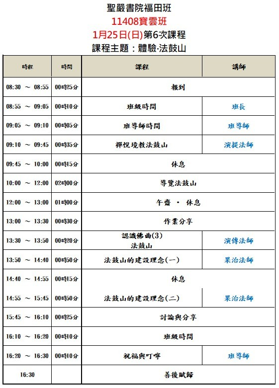

<115/01/25 我們回總本山上課趣>
<html lang="zh-TW">
<head>
  <meta charset="UTF-8">
  <meta name="viewport" content="width=device-width, initial-scale=1.0">
  <title>法鼓山體驗法鼓山－行前確認清單</title>
  
</head>

<body>

  <h1>法鼓山 11408 台中福田班</h1>
  <h2>第6堂「體驗法鼓山」行前確認清單</h2>

  <h3>📌 課程提醒事項</h3>
<ol>
  <li>取消上山者，費用將轉為護持寶雲寺護持功德金</li>

  <li>
    <strong>集合時間：</strong>
    <ul>
      <li><strong>第 1、3、4 車</strong>：AM 5:20（寶雲寺對面慢車道）<strong style="color:red;">出發時間:早上5:40(逾時不候)</strong></li>
      <li>
        <strong style="color:red;">第 2 車</strong>（寶雲寺）：
        AM 5:10（<strong style="color:red;">寶雲寺對面慢車道→出發前往豐原</strong>）
      </li>
      <li>
        <strong style="color:red;">第 2 車</strong>（豐 原）：
        AM 5:40（<strong style="color:red;">豐原全國加油站出發</strong>）
      </li>
    </ul>
  </li>

  <li>
    <strong>用餐資訊：</strong>
    <ul>
      <li>提供早餐（海苔飯捲）、午齋（好收納即可）、藥石（有蓋可扣緊）</li>
      <li>
        容器規範請注意：
        <ul>
          <li>請貼上「組別＋姓名」</li>
          <li><strong>請勿使用雙層、有內層、玻璃材質</strong></li>
        </ul>
      </li>
    </ul>
  </li>
</ol>

  <h3>👕 服裝準備</h3>
  <ul>
    <li><label><input type="checkbox">好走路鞋子（需參觀總本山）</label></li>
    <li><label><input type="checkbox">後背式背包（避免大包小包）</label></li>
    <li><label><input type="checkbox">保暖小物（毛帽、圍巾、手套、暖暖包）</label></li>
  </ul>

  <h3>🎒 學員自備物品</h3>
  <ul>
    <li><label><input type="checkbox">文具用品、綠色學員手冊</label></li>
    <li><label><input type="checkbox">水杯、個人環保餐具</label></li>
    <li><label><input type="checkbox"><strong>藥石空便當盒</strong>（需可堆疊，勿用矽膠/玻璃/雙層）</label></li>
    <li><label><input type="checkbox">遮陽帽／輕便雨衣（不用傘）</label></li>
    <li><label><input type="checkbox">外套、健保卡、個人用藥</label></li>
  </ul>

  <h3>🚌 交通與費用</h3>
  <ul>
    <li><label><input type="checkbox">未繳車資者（800元），請於車上繳交</label></li>
    <li><label><input type="checkbox">確認私人車輛停放地點</label></li>
  </ul>

  

    <button onclick="document.querySelectorAll('input[type=checkbox]').forEach(cb => cb.checked=false)">
      清除所有勾選重來
    </button>
  

  

  <h3 style="background: #ececec;">📅 附件：當日課程表預覽</h3>
  

  

    © 法鼓山聖嚴書院福田班 課程資訊 
    底圖來源：台灣旅圖 (taiwantravelmap.com)
  

</body>
</html>
